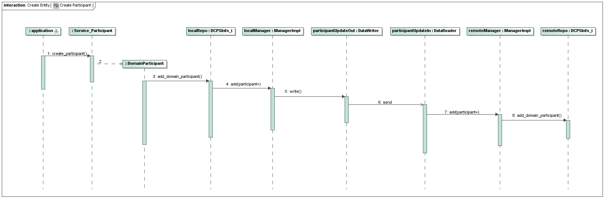
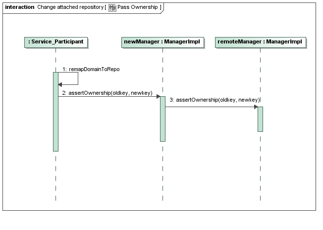
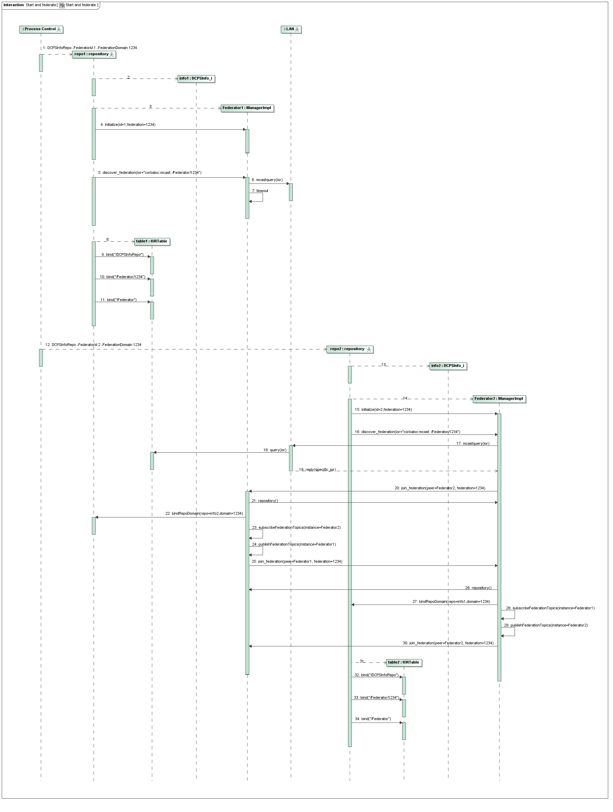
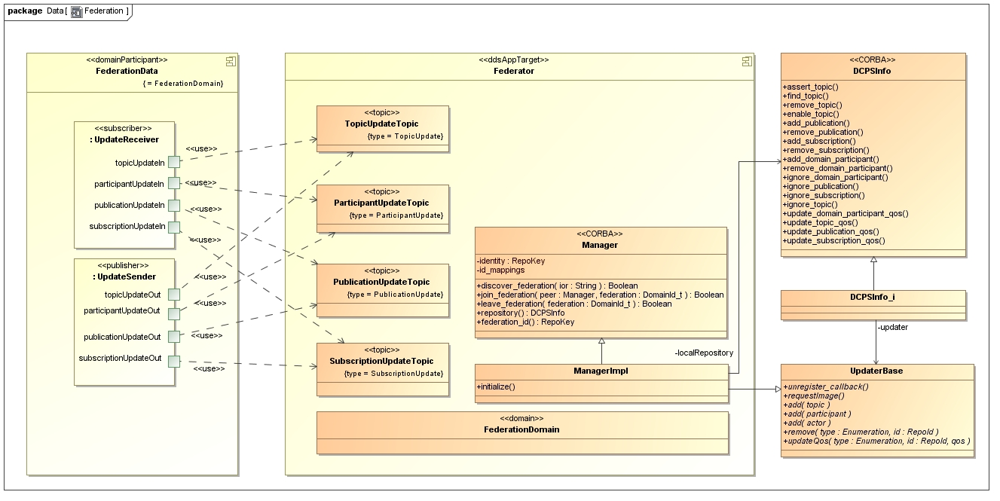

<!-- Adapted from /docs/html/federation/federation.html -->
# OpenDDS Repository Federation Design

<!-- vim-markdown-toc GFM -->

* [Introduction](#introduction)
* [Use Cases](#use-cases)
  * [Normal Operation](#normal-operation)
    * [Application creates a new service Entity](#application-creates-a-new-service-entity)
    * [Application updates an existing service Entity](#application-updates-an-existing-service-entity)
    * [Application destroys an existing service Entity](#application-destroys-an-existing-service-entity)
    * [DataWriter or DataReader becomes associated with other DataReader or DataWriter](#datawriter-or-datareader-becomes-associated-with-other-datareader-or-datawriter)
    * [DataWriter or DataReader becomes unassociated with other DataReader or DataWriter](#datawriter-or-datareader-becomes-unassociated-with-other-datareader-or-datawriter)
  * [Failover](#failover)
    * [ServiceParticipant changes manager for domain to new repository](#serviceparticipant-changes-manager-for-domain-to-new-repository)
  * [Discovery](#discovery)
  * [Join Federation](#join-federation)
    * [Repository joins an unfederated repository](#repository-joins-an-unfederated-repository)
    * [Repository joins an already federated repository](#repository-joins-an-already-federated-repository)
  * [Operate Federated](#operate-federated)
  * [Leave Federation](#leave-federation)
* [Architecture](#architecture)

<!-- vim-markdown-toc -->

## Introduction

OpenDDS is an implementation of the OMG Data Distribution Service (DDS)
specification. This implementation is managed by attaching individual
application ServiceParticipant to a remote repository process which provides a
CORBA IDL interface for managing the service. Application code need not be
aware of the details of this interface as it is used internally by the DDS
ServiceParticipant. The application is required to establish and maintain
connections with these remote processes.

As of this time, each ServiceParticipant is allowed to attach to one or more
repositories for management of individual domains. Currently there is one
repository allowed to manage one or more DDS defined domains for an application
with each domain used by an application managed by one and only one repository.
This means that if the remote repository process managing a specific domain for
an application fails for any reason, that domain and any Topics, publications
or subscriptions will no longer be available to the application. This is
undesirable.

In order to eliminate this problem for users of OpenDDS, a mechanism that
allows multiple repositories to become federated and manage the same domains is
being proposed. This mechanism means that if one repository fails, another
repository will be able to replace it so that applications will be able to
operate correctly as long as at least a single repository is attached.

The proposed mechanism is required to satisfy several use cases during
operation. These cases include operating in the presence of one or more
repositories, switching the management of an applications DDS
ServiceParticipant for any given domain from a failed repository to one that is
still operational.

Previous work done to demonstrate the ability of DDS to provide a data transfer
capability within a dynamic topology of point to point links established the
ability of the DDS service to route data over defined connections within a
topology. Work was done on that project that prototyped interfaces needed to
manage the federation of repositories and can be used directly.

## Use Cases

Federation of repositories is required to satisfy the following use cases:

### Normal Operation

Application ServiceParticipant operates with one or more federated repositories

This is the steady state of an application using a DDS service provisioned by
federated repositories. Applications initialize attaching to one or more
repositories. Each domain utilized by that application is then mapped to a
single repository for managing the Entities within that domain.

#### Application creates a new service Entity

Application creates a new service Entity. Note that these scenarios do not show
any resulting behavior triggered by the creation event. The Operate Federated
use case describes that information.

#### Application updates an existing service Entity

The repository processing is essentially the same as performed for scenario 1
but with the DCPSInfo interface call to the corresponding 'update_..._qos'
method for the entity being destroyed. The application would also need to have
called the corresponding 'update' method as well.

#### Application destroys an existing service Entity

The repository processing is essentially the same as performed for scenario 1
but with the DCPSInfo interface call to the corresponding 'remove' method for
the entity being destroyed. The application would also need to have called the
corresponding 'destroy' method as well.

#### DataWriter or DataReader becomes associated with other DataReader or DataWriter

This operation proceeds without modification from the existing repository and
ServiceParticipant processing. The only difference is that a repository may
have only one end of the association for which to call back into the
ServiceParticipant to make the association. The information to make the
`add_associations` call to the RemoteDataWriter or RemoteDataReader is
available to the repository since it is part of the distributed update
information. This includes the transport endpoint information required for
establishing the connection. Note that this requires that all participants be
able to connect directly with all other participants.

The event that triggers an `add_associations()` call within a repository is
predicated on the ownership of the endpoint. This means that if a repository
'owns' a particular publication or subscription, then it needs to issue the
callback. Since ownership may be passed (see Failover) it is not sufficient for
the repository to check the repository identifier of the actor but ownership
needs to be checked explicitly. It may be the case that an application
ServiceParticipant has passed ownership of remotely created Entities to this
repository or that locally created Entities have had ownership passed to
another repository.

Processing within a given ServiceParticipant is unaffected. Once the
`add_associations` call is made to the RemoteDataWriter or RemoteDataReader all
subsequent processing proceeds without modification.

#### DataWriter or DataReader becomes unassociated with other DataReader or DataWriter

The processing of this scenario is the complement of that described in the
associating scenario. The key is the triggering the `remove_associations`
callback correctly.

### Failover

Application ServiceParticipant redirects service management to different
repository

This is how each application ServiceParticipant redirects its management to a
different repository. If the repository managing a domain within an application
becomes unavailable, through either process or communication failure, then the
application needs to attach to a different repository to manage that domain and
pass ownership within the federation for that applications data to the new
repository.

Scenarios include:
- ServiceParticipant detects repository as unavailable
- ServiceParticipant changes manager for domain to new repository

#### ServiceParticipant changes manager for domain to new repository

This is currently shown as a remote call to the Federator::Manager to assert
ownership with a CORBA request/response call to each remote repository in the
federation to propagate the ownership through the federation. This may be
better done by distributing the ownership information via DDS (as with the
update topics) instead.

The remap operation as shown presumes that all of the Entities created within
the ServiceParticipant are switching ownership to a new repository. This is the
expected granularity at this time since the ServiceParticipant currently only
allows domains to be attached to repositories. If a repository becomes
unavailable, then all of the domains which are attached to it must be
re-targeted to another repository. The remap must change the binding internally
for each and assert the ownership change to the new repository after this
rebinding. The new repository that receives the ownership then needs to
propagate this ownership information out to the remainder of the federation.

The assertOwnership operation as shown provides the old repository identifier
and the new repository identifier. This allows the ownership mapping to be
maintained by repository identifier and domain within the repositories.
Unfortunately this may not be sufficient. It is not only possible but likely
that data elements created within a repository have been created by separate
ServiceParticipants. The ability for individual ServiceParticipants to change
the attached repository for a domain is required. This means that either
ownership needs to be maintained keyed with the ServiceParticipant that created
the data (ownership is by ServiceParticipant) or ownership needs to be asserted
and maintained for each individual data element within the repository.

### Discovery

This is where the rubber meets the road for federation. This is the mechanism
to allow repositories to become federated. The details of this have not been
determined as of this time. As each repository is started, it should be joined
into an existing federation (the first repository will join an empty
federation). Discovery of the federation and choosing how many connections to
make into that federation are choices that need to be made. Each process will
have an incarnation each of the DCPSInfo and Federator::Manager interfaces.

Since the goal is to make connections between different incarnations of
identical interfaces, it is unlikely that use of the standard 'mcast' protocol
will succeed, since that assumes that only one incarnation of an interface will
answer. Use of a NamingService or Implementation Repository in a separate
process would be pushing the single point of failure to another location.
Collocating one of these services within a repository process while possible
generates other problems; such as how to choose where to locate the service and
what happens if that process becomes unavailable. We end up with the same
problem as we had initially.

Scenarios include:
- Starting and initializing the first repository
- Starting and initializing additional repositories
- Discovery of remote repository while operating

### Join Federation

This is where a repository becomes federated with other repositories. This
involves establishing communications with another repository and synchronizing
the internal data between the repository and the federation. At the end of this
process, each repository within the federation will have a copy of the same
information, with ownership - or the ability to write or update a piece of data
- held by one and only one repository for each data item.

Part of joining a federation includes how the individual repositories are
connected. The distributed update data does not need explicit connectivity
since it is done via DDS which does not require references to be held at a high
level between participants. The join and leave operations and (currently) the
assertion of ownership are CORBA IDL interfaces and references to other
repository Federation::Manager incarnations are required to invoke these
operations. When joining a federation, references to all participating
repositories can be made available to all repositories within the federation,
or some subset of references can be maintained. Passing all references would be
a good solution for smaller (for some sense of smaller) systems. As the number
of repositories within a federation grows this may become large enough to
become undesirable.

The initial implementation will pass all available references to all
participating repositories but only invoke operations on a single reference.
The initial reference that was used to join the federation will be the first
one used. There does not appear to be a compelling reason to chose another
interface other than randomly at this time if connectivity to the first
reference is lost.

Scenarios include:
 - Repository joins an unfederated repository
 - Repository joins an already federated repository

#### Repository joins an unfederated repository

This is when two repositories become federated for the first time. Both
repositories are unfederated at the start of the scenario and each will become
federated with an attachment to the other by the close of this scenario. The
overall processing, including a gloss of the startup and discovery is
illustrated below. Note that the scenario processing for the join is
symmetrical. That the passive (callee) participant to the first
`join_federation()` call is the participant which is the first to attach to the
other may not be immediately intuitive.

Steps 20 through 30 of this diagram illustrate this scenario.

#### Repository joins an already federated repository

This scenario is identical to the previous scenario with the omission of steps
22, 23 and 24. Since the existing, already federated, repository already as an
attachment for publication and subscription to the Update Topics used for
federation, it is not necessary to reestablish this attachment.

### Operate Federated

Repositories operate within a federation of repositories.

This is the steady state of a federation of repositories. This involves
maintaining the coherency of data within the federation as changes are made to
the managed metadata.

Scenarios include:
 - Application creates new service Entity and no associations are created
 - Application creates new service Entity and associations are created
 - Application updates existing service Entity and no new associations are made
 - Application updates existing service Entity and new associations are created
or existing ones removed
 - Application deletes existing service Entity and no associations are removed
 - Application deletes existing service Entity and existing associations are
removed

These are the same as "Normal Operation".

### Leave Federation

Repository leaves the federation.

This is where a repository becomes disconnected from other repositories. This
involves communications with other repositories within the federation becoming
unavailable. At the end of this process, each repository will retain
information about only reachable service Entities and have removed all other
information. This means that if repositories become disjoint such that they no
longer contain information about managed DDS Entities for each other, any
established associations between these Entities will be removed, regardless of
whether the association could have been maintained independently of the
federation.

A repository might leave a federation due to being commanded to leave the
federation by the user application or if connectivity with the federation is
not available.

There are some issues with federation topology and connectivity discussed in
the join federation case that are applicable here.

Scenarios include:
 - Repository loses connectivity to federation
 - Repository leaves federation

## Architecture

The DDS specification formal/07-01-01 describes the service architecture.
OpenDDS extends this architecture to provide a full implementation including
features not specified by the OMG.  The OpenDDS architecture currently contains
objects providing services for the following:
- ServiceParticipant - singleton within each application using the DDS service encapsulating the service API
- Implementations - implementations for all DDS defined objects
- Transport - Interfaces, configuration objects and implementations providing low level transport services
- Repository - service metadata manager

The features allowing federation of repositories will be part of the OpenDDS
extended architecture. These include the addition of a CORBA IDL interface
incarnation within the repository process to manage the federation activities
and DDS publications and subscriptions for distributing data coherency updates.
Modifications to the ServiceParticipant within the application processes is
also required.

Federation scope identifiers for the managed data are required. This allows
each DDS Entity to be uniquely identified within the federation. In order to
allow repositories the ability to join and leave a federation at any time
without requiring synchronization of internal state before becoming federated,
the federation wide identifiers will be mapped to and from the internal
identifiers used within the repository to locate individual Entities.

When data is transfered over the transport layer, a publication Id value is
sent as part of the header information. This publication Id value must be a
federation wide identifier value in order to avoid misidentifying samples. This
means that the entire Federation scope identifier is marshaled with each
sample.

The basic feature of federation is the replication of repository information
across all federated repositories. This replication is done by publishing data
modification events from the originating repository to all other federated
repositories. The nature of the service metadata allows only a single
application ServiceParticipant to create or modify any given Entity. This means
that only a single writer of the data is allowed at any time, which simplifies
the required replication behavior. When management of a ServiceParticipant for
any given application is transitioned from one repository to another the
ownership of the Entity for purposes of writing is effectively transfered as
well. Each repository retains knowledge of Entity ownership in order to
determine which repository is required to make callbacks to the Entity and
which are not allowed to do so.

The mechanisms for transferring the management of application
ServiceParticipants from one repository to another is performed using an
enhancement to the existing multiple repository feature of OpenDDS and an
additional interface method for the repository. When a domain is switched from
one repository to another, a call to a new `attach_participant()` method for
each DomainParticipant within that domain in that ServiceParticipant is made to
the repository which is to become the manager for those DomainParticipants.
This allows that repository to obtain ownership of that DomainParticipant, as
well as its contained Entities, which it then publishes to the other federated
repositories.

Failure or unreachability of a repository is detected by the applications
through modifying the specified default `LIVELINESS.lease_duration` QoS policy
value of the DCPSParticipant Built-in Topic. Failover sequencing is initiated
by installing a federation ParticipantDataDataListener into the Built-in Topic
reader for the DCPSParticipantData Built-in Topic. This means that the
application will not be able to install a listener at this location without
providing a separate mechanism to initiate failover sequencing.

Modifications to existing OpenDDS objects being proposed to provide the
federation feature: ServiceParticipant - addition of federation scope
publication identification mappings. Extension of the multirepo feature to make
remote calls to the new repository for each DomainParticipant within a managed
domain; OpenDDS::DataSampleHeader - modified to use the federation scope
publication identification values.

Additional objects are being proposed to provide the federation feature:
Federator::Manager - CORBAL IDL interface to allow federation of repositories.
Update publications and subscriptions for distribution of data updates within
the federation.

For federated operation data needs to be made available to all federated
repositories in order to ensure the ability of any repository to provision any
attached ServiceParticipant. This is done using the UpdateManager and Updater
persistence interfaces to push create, update and delete events as well as
ownership assertions on managed data to the entire federated set of
repositories.

Additional interfaces to allow repositories to become federated as well as to
remove themselves from federation are provided as well. A candidate extension
of the repository including additional CORBA IDL interfaces and DDS Topics for
federation is:

PSInfo and ~Updater are existing components of the repository while the
Federator::Manager is a new component. The DDS Topics for
Federator::ParticipantUpdateTopic, Federator::TopicUpdateTopic,
Federator::PublicationUpdateTopic and Federator::SubscriptionUpdateTopic are
published by the Federator::Manager through the ~Updater publisher to propagate
changes to other repositories within the federation. The Federator::Manager
creates subscriptions to these topics published from other repositories as they
join the federation.
